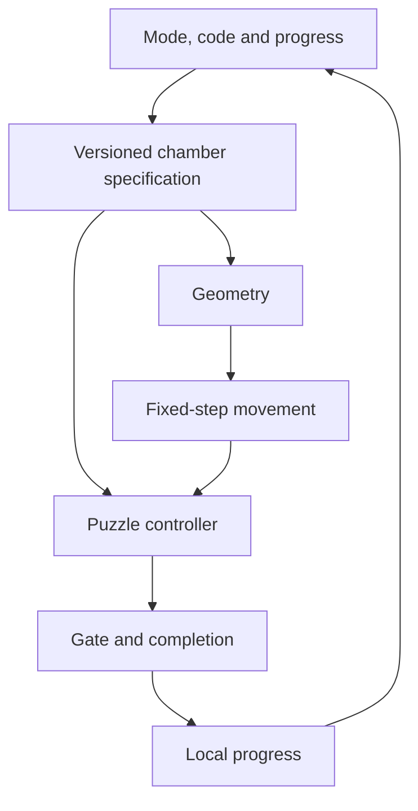

# DEPTH 0.4 architecture

`index.html` loads `src/main.js` as a native ES module. There is no framework,
production dependency, build service, remote API or backend.

| Module | Responsibility | Boundary |
|---|---|---|
| `core/Game.js` | Run lifecycle, movement integration, combat, score, swapping and finish | Fixed-step input snapshots; no DOM |
| `core/Time.js` | 120 Hz clock and bounded catch-up | Max 12 physics steps per display frame |
| `core/Input.js` | Keyboard, mouse and multipointer touch | Edge actions, dialog isolation, release on blur |
| `physics/PlayerPhysics.js` | Integration, platforms, bounds and rail entry | Returns supporting platform ID; coordinates independent of viewport |
| `physics/Collision.js` | Swept collision and one-way landing | Pure geometry |
| `physics/RailPhysics.js` | Parametric rail movement | Stylized y(x) curves, not energy-conserving 360° loops |
| `story/Campaign.js` | Versioned chamber specifications, clue text, difficulty and seed policy | Pure deterministic data generation |
| `story/SequencePuzzle.js` | Ordered contacts, direction, identity, hold, pulse and deadlines | Progress and error events; solved state latched |
| `story/SwitchPuzzle.js` | Triangular Lights Out puzzle | Solvable binary board with contact debouncing |
| `story/StoryProgress.js` | Discovery, journal, puzzle integration, full-height seal and echo | Runs before distance score and completion |
| `world/StoryLevel.js` | Geometry, authentic/false pads, hazards and optional relic | One camera/room loaded at a time |
| `world/LevelGenerator.js` | Arcade routes and narrative world dispatch | Original four arcade patterns remain |
| `render/Renderer.js`, `StoryRenderer.js` | Canvas, camera, effects and rule presentation | Render-only randomness |
| `audio/Audio.js` | Synthesized tones and counted pad pulses | User gesture unlock; optional for solving |
| `core/Storage.js` | Up to 100 local score/time entries | Keys separate mode, generator identity, practice and controls |
| `core/Progress.js` | Stable campaign achievements, unlocks, backup merge and expedition checkpoint | Validated schema, 100 campaign records, one active expedition |
| `main.js` | Menu, map, dialogs, save integration, input and HUD | Browser adapter for the pure engine |

## Simulation and lifecycle

World height: 720 units; floor: 594; sphere radius: 14. Velocities are units/s,
gravity is units/s². The clock discards excess real time after a stall. Timers measure
simulated active play, not wall-clock time. Pause, journal and hidden tabs stop it.

Lifecycle: ready → running ↔ paused → finished. Introduction remains in ready.
Each completed narrative chamber ends with a result and an explicit next button.
The next chamber creates a fresh Game. Replaying does not remove achievements.

Nox and Luma have separate Player instances in cooperative chambers. The inactive
character freezes in place. Returning to a supported character preserves contact;
only leaving and landing again activates that pad. The final story exit requires Luma.

## Difficulty and generation

Story maps levels 1–100 to ten chapter families. Chamber identity is `story-v4:level`.
Expedition identity includes version, normalized seed, intensity, run length and room.
A deterministic deck places each of the nine basic families once per ten rooms;
the combined family closes each deck. No adjacent deck boundary repeats that family.

Difficulty increases with story depth or expedition depth/intensity, then caps at 1.
Bounds protect minimum platform widths and pulse windows. Chapter wave lengths ease
slightly when a new rule is introduced. See `Campaign.js` and the [audit](AUDIT-0.4.md).

A generated room has at most eight puzzle pads, a bounded number of ground hazards
and one relic. Completed worlds are discarded on advancement. Abismo supports up to
100,000 rooms per run; it does not instantiate that many rooms or claim mathematical infinity.

## Puzzle contracts

A contact is debounced until the player leaves. A sequence step may require pad,
movement direction, character, continuous residence or an open rhythm window. Wrong
inputs explain which constraint failed. Advanced sequences preserve completed blocks.
Only Expert/Master expeditions apply an active-play memory deadline; the journal pauses it.

Switch pad i toggles bit i and bit i+1, except the final pad, which toggles itself.
This triangular transform can always be solved by addressing lit bits left to right.
Initial boards are made from a known nonempty solution. Repeated contact does not toggle.

The locked seal clamps x across the complete playable height before scoring or finish.
Infinite jumps cannot bypass it. The echo is collected when crossing its x boundary
after solving, including airborne traversal. Optional relics use swept pickup collision.

## Save and score contracts

- Completion alone unlocks the next story chamber; no stars or grind are required.
- Stars are independent cumulative achievements: complete, clean in standard mode,
  and relic. Clean means no puzzle mistakes and no impacts in that attempt.
- JSON schema `depth.journey.v1` validates records, finite times, seed length, depth,
  intensity and route length. Imports merge best time and earned achievements.
- Legacy 0.3 first-level records unlock chamber 2 without granting unproven medals.
- Expedition save records the current chamber entrance; completion advances that checkpoint.
- Interrupted chambers restart from their entrance. Exact physics state, partial puzzles,
  settings and all arcade marks are not included in exported journey backups.
- Score comes from new distance, once-only pickups and puzzle completion. Standing still
  or revisiting a solved pad cannot farm score. Arcade checkpoints preserve used rewards.
- Save failures are surfaced, while the in-memory game stays playable and exportable.

## Validation and limitations

`npm run validate` invokes Node directly for regressions, syntax and complete pilot runs.
It emits Markdown/JSON reports and fails its process exit code on a failed gate.
The input-only pilot knows solutions; it is evidence of feasibility, not human playtesting.

Canvas layout, actual audio, touch ergonomics, performance and visual accessibility
still require real-browser sign-off. Other limits include no gamepad/remapping,
full nonvisual play, replay files, custom authored-room editor, trusted leaderboard
or online synchronization. See [PLAYTEST.md](PLAYTEST.md) and [LONGEVITY.md](LONGEVITY.md).
