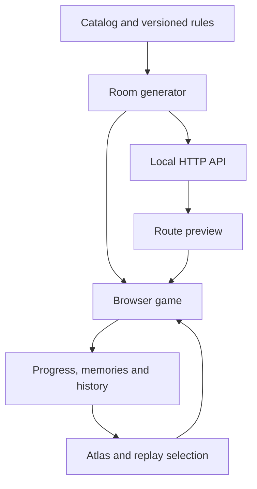

# DEPTH 0.5 architecture

Native ES modules, Canvas 2D, Web Audio and a fixed 120 Hz simulation. Node 20+
serves the static game and a local, stateless procedural API. There are no production
dependencies, external generation services, accounts or database.

| Module | Responsibility |
|---|---|
| `content/Catalog.js`, `Memories.js` | World/chapter/room relationships, characters, mechanics, rewards and twenty optional scenes |
| `story/Campaign.js` | Version 5 chamber rules, progression, narrative clues and seeded world selection |
| `generation/v4/` | Frozen version 4 generators; compatibility fixtures guard their output |
| `world/StoryLevel.js`, `WorldFeatures.js` | One deterministic room, required puzzle pads and optional world corridors |
| `generation/Generator.js` | Strict request normalization, reusable generation envelope and structural validation |
| `server/http.mjs` | Loopback HTTP API and static files; bounded body/requests; no data writes |
| `core/Game.js` | Lifecycle, player integration, scoring, abilities, swapping and completion |
| `core/Time.js` | Fixed-step clock; at most 12 catch-up steps per display frame |
| `core/Input.js` | Edge actions, dialog isolation, multipointer touch and release on blur |
| `physics/` | Movement, rails, one-way platform landings and swept collision |
| `mechanics/WorldSystems.js` | Beam phases, patrols, fragile supports, springs, fields and character abilities |
| `story/SequencePuzzle.js`, `SwitchPuzzle.js` | Stateful rule controllers and debounced contacts |
| `story/StoryProgress.js` | Clue/journal, optional memories, full-height seal and completion echo |
| `core/Score.js` | Source ledger, combo rewards and bounded deductions |
| `core/Progress.js`, `History.js` | Save validation, independent achievements, scenes, attempts and backup merge |
| `core/Storage.js` | Up to 100 score/time bests, keyed separately by route/practice/control mode |
| `render/` | Camera, world motifs, mechanical silhouettes, rule labels and effects |
| `ui/Atlas.js`, `main.js` | Catalog presentation, menus, map, history, API preview, save integration and HUD |

## Generation contracts

`generateLevel(parameters)` returns `schemaVersion`, `generatorVersion`, `id`,
normalized `parameters`, initial `world` and `validation`. HTTP GET/POST and direct
module calls agree byte-for-byte for the same parameters. The browser route preview
also compares the returned geometry against a locally constructed Game before play.
The interface never executes scripts or installs arbitrary imported world JSON.

Version 5 IDs are `story-v5:level` or
`exp-v5:SEED:intensity:length:level[:selectedWorld]`. The selected-world suffix is
omitted for mixed expeditions. Mixed decks use each of nine base families once,
then synthesis. Explicit worlds alternate their two families. Difficulty is clamped
to [0,1]; geometry, number of objects, sequence length and timing windows are bounded.
Only the active room is loaded, even in a 100000-room expedition.

`generatorVersion: 4` dispatches to the preserved source under `generation/v4/`.
Geometry fixtures are hashes from base commit `b4cc2400bec93faaa542878853e6a100cd0e3085`.
Legacy expedition saves without a version resume v4. The newer catalog can describe
old chapters without altering their room data. Future shared source changes must
keep those fixture tests passing or introduce an explicit migration/version policy.

API validation is structural: bounds, IDs, rule parameters, required pads, references
and the closed seal geometry. It does not run physics. Its response always states
`reachability: "not-run"`; the separate input pilot supplies sampled feasibility
checks. The full [HTTP contract](api/README.md) and [OpenAPI](api/openapi.json) document
limits, errors and local-only operation.

## Simulation and lifecycle

World height 720; floor 594; radius 14. Positions use world units, velocities units/s
and acceleration units/s². Lifecycle: ready → running ↔ paused → finished. The clock
measures active simulated time; pause, journal and focus loss freeze all mechanics.

A step updates the chosen character, world phases, optional ability, movement,
puzzle/gate, world contacts, pickups, hazards, arcade combat and finish. Distance
rewards occur after the gate clamp. A respawn does not sweep across intervening
pickups. The seal covers the complete playable height and cannot be bypassed by
repeated jumps, dash or protection.

Both characters have independent Player instances when cooperation is enabled.
The inactive one freezes, including its cooldown. Returning to a player already on
a pad preserves contact. The final story exit requires Luma. Ancla protects 0.65 s
with a 6 s cooldown. Velo gives 2.4 s low gravity and 0.35 s protection with an 8 s
cooldown. Energy removes 3 s of remaining cooldown. Respawn resets ability state.

Puzzle platforms and optional fragile supports are separate collections; standing
on a support cannot activate a puzzle. Fragile supports return after collapse.
Beam damage depends on its visible phase; patrol contact uses relative swept
motion. Springs require a downward landing. Currents modify acceleration locally.

Sequence steps can constrain pad, direction, character, continuous residence and
rhythm window. Late mistakes preserve completed three-step blocks where enabled.
Only advanced expeditions impose a deadline between memories. Switch i toggles i
and i+1; the last toggles itself. This triangular system is always solvable by
addressing lit bits from left to right. Completed puzzles pay once.

## Progress, history and score

The stable `depth.journey.v1` schema adds `memories` (up to 20 IDs), `history`
(up to 200 attempt records) and version/world fields on the active expedition.
Older backups still load. Unknown scene/world IDs are dropped; histories validate
types, finite values, dates, route bounds and outcomes. Imports merge achievements
and scenes, deduplicate attempt IDs and keep the newest 200 entries. Import file
size is capped at 1 MB in the UI; typical complete backups are much smaller.

Complete a chamber to save its found scenes and earn completion/relic/precision
stars. Each star is independent and accumulates across attempts. Badges derive
from completing all 20 chambers of a story world. Neither scenes nor badges block
advancement. Replay never removes earned achievements.

`recordAttempt` runs on completion, restart or explicit menu exit. It records once
per Game, excludes unplayed introductions, and saves mode/world/room, exact generator
settings, practice, time, score, ledger, hits, mistakes, ability uses and earned stars.
Closing a tab mid-room does not record that unfinished attempt. This is result
history, not input replay or online telemetry.

Score changes go through a source ledger; distance, puzzle, pickup, combat, rail,
completion and penalty amounts sum to the score. Deductions cannot go below zero.
World v5 rewards are documented in [WORLDS.md](WORLDS.md). Legacy/arcade values remain.
Record keys include versioned route identity and separate practice and control modes.

Storage failures preserve in-memory play and show the export option. Backups do not
include exact physics state, all preferences or the separate complete arcade record
store. Progress is local and user-editable, with no trusted leaderboard claims.

## Validation and boundaries

`npm run validate` runs regressions, syntax/JSON checks and a pilot with movement,
jump and swap inputs. Reports go to `build/validation/`. The pilot knows the
solutions; its success proves sampled reachability, not human difficulty or fun.
Real-browser layout, audio, touch, frame pacing and accessibility sign-off remain
pending. An optional browser smoke covers the atlas, API preview and history too.

No public API deployment, multiplayer, server saves, full editor, gamepad mapping,
nonvisual gameplay or long-term retention study is included. See [PLAYTEST.md](PLAYTEST.md)
and the [longevity plan](LONGEVITY.md).
